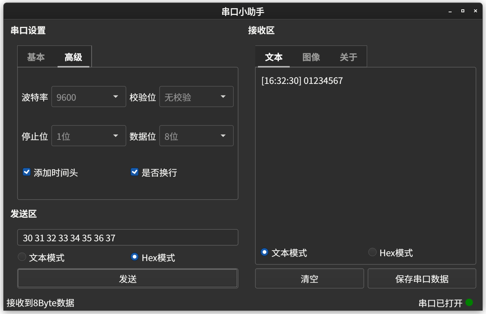
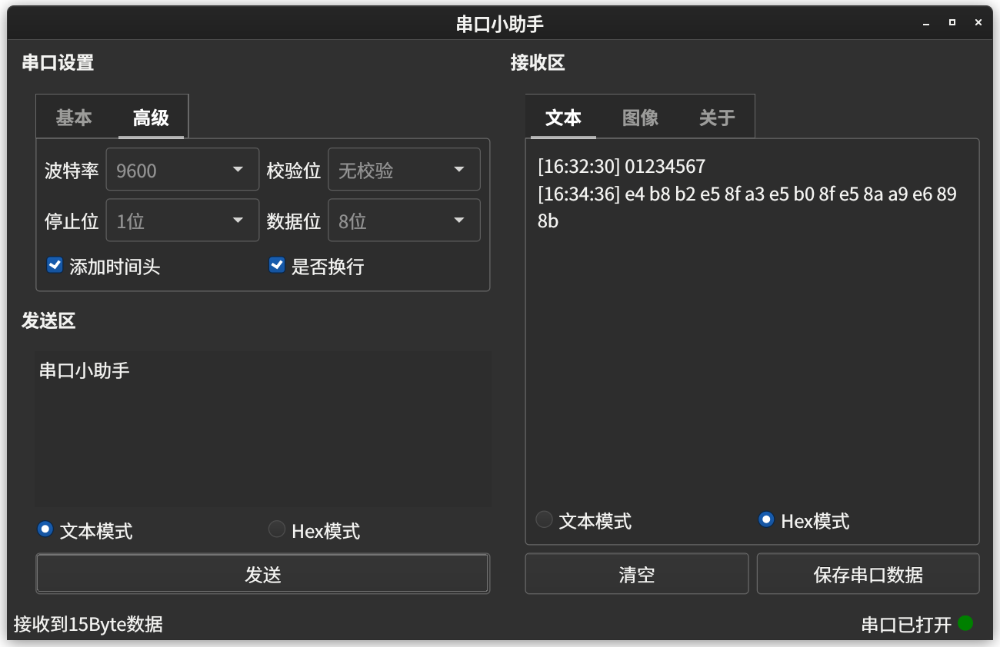

# serialPortAssistant
## 简介
基于Qt的串口小助手软件设计
## 自动构建状态

|[Linux][linux-link]|[Windows][windows-link]|[MacOS][macos-link]|
|-------------------|-----------------------|-------------------|
|![linux-badge] |![windows-badge] |![macos-badge] |

|[License][license-link]| [Release][release-link]| [Download][download-link] | [Stars][stars-link] |
|-------------------|-----------------------|-------------------|------------|
|![license-badge] |![release-badge] |![download-badge] |![stars-badge] |

[windows-link]: https://github.com/ambition-echo/serialPortAssistant/actions/workflows/Windows.yml
[windows-badge]: https://github.com/ambition-echo/serialPortAssistant/actions/workflows/Windows.yml/badge.svg

[linux-link]: https://github.com/ambition-echo/serialPortAssistant/actions/workflows/Linux.yml
[linux-badge]: https://github.com/ambition-echo/serialPortAssistant/actions/workflows/Linux.yml/badge.svg

[macos-link]: https://github.com/ambition-echo/serialPortAssistant/actions/workflows/MacOS.yml
[macos-badge]: https://github.com/ambition-echo/serialPortAssistant/actions/workflows/MacOS.yml/badge.svg

[release-link]: https://github.com/ambition-echo/serialPortAssistant/releases
[release-badge]: https://img.shields.io/github/v/release/ambition-echo/serialPortAssistant

[license-link]: https://github.com/ambition-echo/serialPortAssistant/blob/master/LICENSE
[license-badge]: https://img.shields.io/github/license/ambition-echo/serialPortAssistant

[download-link]: https://github.com/ambition-echo/serialPortAssistant/releases
[download-badge]: https://img.shields.io/github/downloads/ambition-echo/serialPortAssistant/total
[stars-link]: https://github.com/ambition-echo/serialPortAssistant
[stars-badge]: https://img.shields.io/github/stars/ambition-echo/serialPortAssistant

## 软件截图

